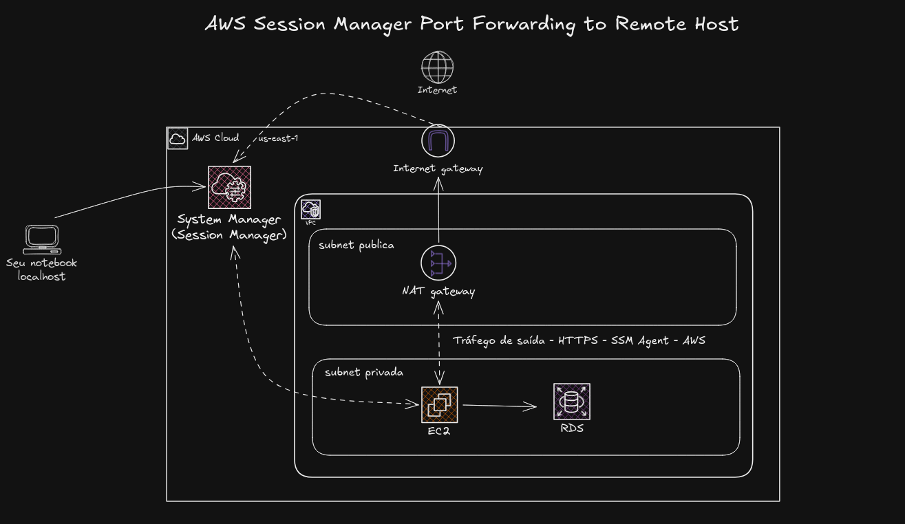

# AWS Systems Manager — Remote Host Port Forwarding



Laboratório Terraform para acessar um RDS PostgreSQL privado pelo Session Manager, usando uma EC2 privada como intermediária. A rede é mantida pelo projeto `aws-vpc`.

## Estrutura

Os arquivos `.tf` ficam na raiz e compartilham backend, provider e estado. Os arquivos `ec2_session_manager_remote_host_port_forwarding_*` configuram a EC2 e seu acesso ao Systems Manager. `rds.tf` cria o PostgreSQL, o subnet group e as regras de segurança.

A EC2 não possui IP público nem regras de entrada. O RDS aceita TCP/5432 somente do Security Group da EC2. O banco é Single-AZ, com as subnets privadas A e B no subnet group.

Aplique primeiro `aws-vpc`, na mesma conta e região, para publicar `/vpc_id`, `/private_subnet_1a_id` e `/private_subnet_1b_id` no Parameter Store. A subnet da EC2 precisa de saída HTTPS pelo NAT Gateway para o Systems Manager.

## Aplicar

São necessários Terraform, AWS CLI e o plugin do Session Manager. Configure as credenciais AWS, o bucket de estado em `live/sandbox/backend.tfvars` e as variáveis em `live/sandbox/terraform.tfvars`. A identidade que abre o túnel precisa de permissões para Session Manager.

Na raiz do projeto:

```bash
terraform init -backend-config=live/sandbox/backend.tfvars
terraform plan -var-file=live/sandbox/terraform.tfvars -out=tfplan
terraform apply tfplan
```

## Acessar o banco

Consulte os outputs:

```bash
terraform output -raw instance_id
terraform output -raw rds_address
terraform output -raw db_master_secret_arn
terraform output -raw start_session_command
```

Quando a EC2 estiver online no Systems Manager, execute o comando impresso por `start_session_command` e mantenha o terminal aberto. Ele usa `AWS-StartPortForwardingSessionToRemoteHost` para encaminhar `localhost:5432` ao RDS.

Consulte a senha no Secrets Manager usando o ARN retornado por `db_master_secret_arn`; sua identidade precisa de `secretsmanager:GetSecretValue`. Em outro terminal:

```bash
psql "host=localhost port=5432 dbname=$(terraform output -raw db_name) user=$(terraform output -raw db_username) sslmode=require" -W
```

No DBeaver, use `localhost`, porta `5432`, banco `appdb`, usuário `dbadmin`, a senha do segredo e SSL habilitado. Ajuste banco e usuário caso altere as variáveis. Se a porta local estiver ocupada, altere `localPortNumber` no comando da sessão e a porta do cliente. Encerre o túnel com Ctrl+C.

## Remoção

```bash
terraform plan -destroy -var-file=live/sandbox/terraform.tfvars -out=tfplan.destroy
terraform apply tfplan.destroy
```

A remoção exclui o banco e seus dados, sem snapshot final. A rede pertence ao projeto `aws-vpc` e permanece provisionada.
